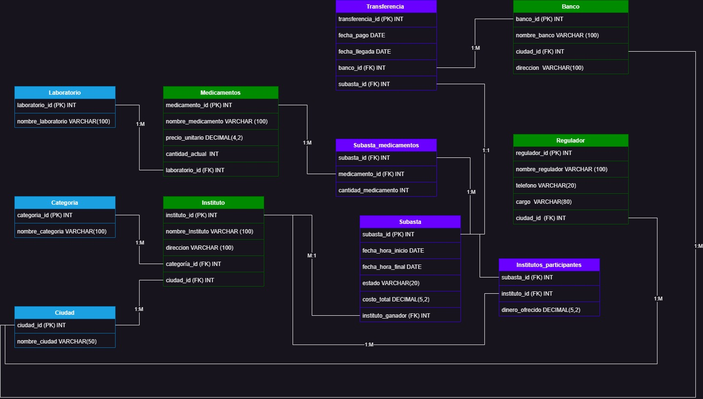

## Creador
* Nombre: Miguel Molina Flores
* Codigo: 56197

# Base de Datos para el control de la distribución de medicamentos en el sistema de la Caja Petrolera De Salud

El presente proyecto busca crear una base de datos que administre y lleve un registro de la adquisición de los medicamentos esceciales para las diferentes administraciones de la Caja Petrolera de Salud en la gestión 2023. Estos medicamentos son adquiridos en subastas dentro de las instituciones.
Por lo tanto en el trabajo se buscara registrar todas las transacciones de los medicamentos entre las distintas entidades para llevar un registro en cuestión a fechas, medicamentos transferidos, reguladores de las subastas, institución destino, banco encargado de la transaccion monetaria y costo total.

## Índice

- [Descripción de la entidad](#descripción-de-la-entidad)
- [Diagrama de la base de datos](#diagrama-de-la-base-de-datos)
- [Requisitos Técnicos](#requisitos-técnicos)
- [Ejecución local](#ejecución-local)

## Descripción de la entidad

La Caja Petrolera de Salud (CPS) es una institución de seguridad social en Bolivia que brinda servicios de salud a los trabajadores del sector petrolero y sus familias. Fue creada en 1955 y es una de las cajas de salud más grandes y reconocidas del país. Su objetivo principal es garantizar la atención médica y la protección social de sus afiliados, ofreciendo servicios de calidad y promoviendo la prevención de enfermedades.

Los beneficiarios de la CPS incluyen a los trabajadores activos, jubilados y sus dependientes directos, quienes tienen acceso a una amplia gama de servicios médicos, incluyendo consultas, hospitalización, cirugías, medicamentos, atención odontológica, servicios de maternidad, entre otros. Además de la atención médica, la CPS también se dedica a promover programas de prevención y promoción de la salud, así como a brindar servicios de bienestar y recreación para sus afiliados.

Es importante destacar que la Caja Petrolera de Salud es una entidad específica para los trabajadores del sector petrolero en Bolivia y opera de manera independiente de otras instituciones de seguridad social en el país, como el Sistema Nacional de Salud (SNS) o el Seguro Social Obligatorio de Largo Plazo (SOAT).
## Diagrama de la base de datos

## Contraseña
123m (para todos los servidores)

## Requisitos Técnicos

Requisitos técnicos para ejecutar en Windows 10 o Windows 11:

* Windows 11 de 64 bits: versión Home o Pro 21H2 o superior, o versión Enterprise o Education 21H2 o superior.
* Windows 10 de 64 bits: versión Home o Pro 21H1 (compilación 19043) o superior, o versión Enterprise o Education 20H2 (compilación 19042) o superior.
* Habilitar la función WSL 2 en Windows.

Se requieren los siguientes requisitos de hardware para ejecutar WSL 2 en Windows 10 o Windows 11:
* Procesador de 64 bits con Traducción de Direcciones de Segundo Nivel (SLAT).
* 4 GB de RAM del sistema.
* El soporte de virtualización a nivel de BIOS debe estar habilitado en la configuración del BIOS. Para obtener más información, consulta la sección de Virtualización.

## Ejecución local

1. Clonar el repositorio que contiene el docker con el siguiente comando:

  `git clone https://github.com/Mickysaurio-rex/BD_Primer_Parcial.git`

2. Ubicalo en una carpeta, mejor si es una recien creada, e ingresa en esta misma:
  `cd [nombre del directorio]`
  
3. Levanta los servicios con los siguientes comandos:
   `docker-compose up`
   `docker-compose -f [nombre del archivo que tiene la configuracion del docker] up`

4. Para detener los servicios:
   `docker-compose down`
   `docker-compose -f [nombre del archivo que tiene la configuracion del docker] down`
